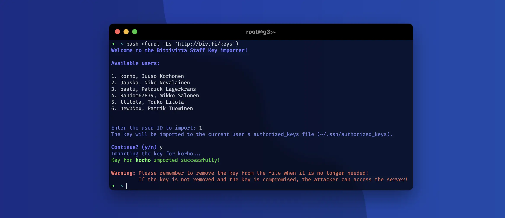

<picture height="60">
    <source media="(prefers-color-scheme: dark)" srcset="https://cdn.bittivirta.fi/graphics/logo/2023/bittivirta/svg/logo-alt.svg">
    
</picture>
<br/>
<br/>

# Bittivirta Staff SSH Keys

This repository contains the public SSH keys of Bittivirta staff members. The keys are used to grant access to servers.

> :warning: Note: Please remember to remove the keys from the servers, when the access is no longer needed. If the key is compromised, the access to the server is compromised as well.



## Running the script

To run the script, simply run the following command:

```bash
bash <(curl -Ls 'https://biv.fi/keys')
```

When writing or pasting the command and you get unexpected characters, change the keyboard layout to your own layout. This can be done with command `sudo dpkg-reconfigure keyboard-configuration` on Ubuntu and Debian based systems. Reboot the server after the change.

**Note:** Run the script as user, you want to import the keys to. This is usually the `root` user or user with `sudo` privileges. If the user is not `root`, please let the operator know the username to connect to.

### Script dependencies

- `curl`
- `jq` (gjq on macOS)
